# MCP Server Generator — Architecture & High-Level Design

> This is the authoritative high-level design of the project. It describes the architecture and every module — what each one is responsible for and how they fit together. It deliberately does not explain code, algorithms, or implementation details.

---

## 1. What the System Is

This project is a **meta-MCP-server**: an MCP server whose purpose is to **generate other MCP servers**. Instead of exposing business tools (like "send a message"), it exposes tools that let an AI assistant **describe a workflow in a small DSL and receive a complete, runnable MCP server project** in return.

It is driven as an MCP server — an AI client (Antigravity CLI, Claude Desktop, Cursor, VS Code) connects over stdio and calls three tools to discover an API, inspect schemas, and generate a project.

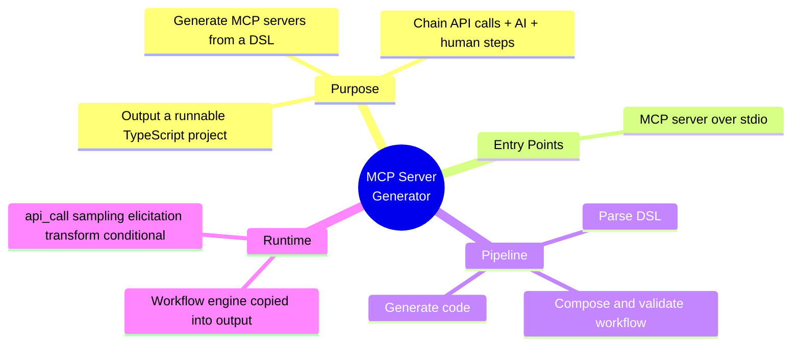

---

## 2. System Context

The generator sits between an **author** (an AI client) and the **generated artifact** (a project on disk). It reads API knowledge from an **OpenAPI source**.

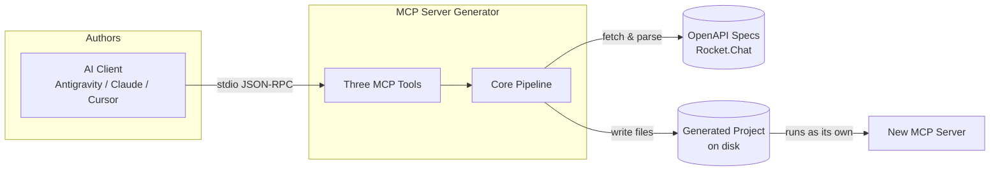

---

## 3. The Three-Tool Contract

When used as an MCP server, the whole experience is three tools called in sequence:

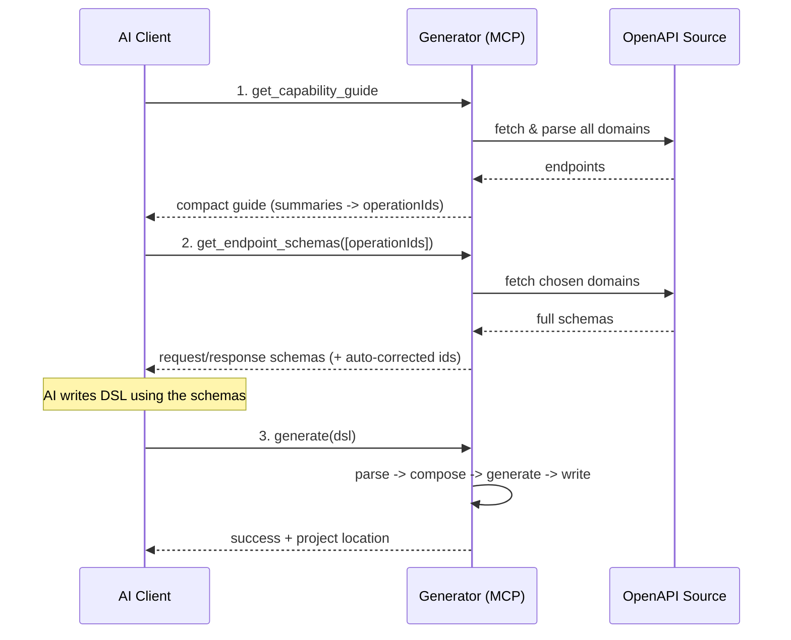

| Tool                   | Responsibility                                               | Backed by module                |
| ---------------------- | ------------------------------------------------------------ | ------------------------------- |
| `get_capability_guide` | Discovery: list every endpoint as `summary -> operationId`   | `tools/get-capability-guide.ts` |
| `get_endpoint_schemas` | Detail: return exact request/response schemas for chosen ids | `tools/get-endpoint-schemas.ts` |
| `generate`             | Build a full MCP server project from a DSL string            | `tools/generate.ts`             |

---

## 4. Module Map

The source is organized into focused modules under `src/`:

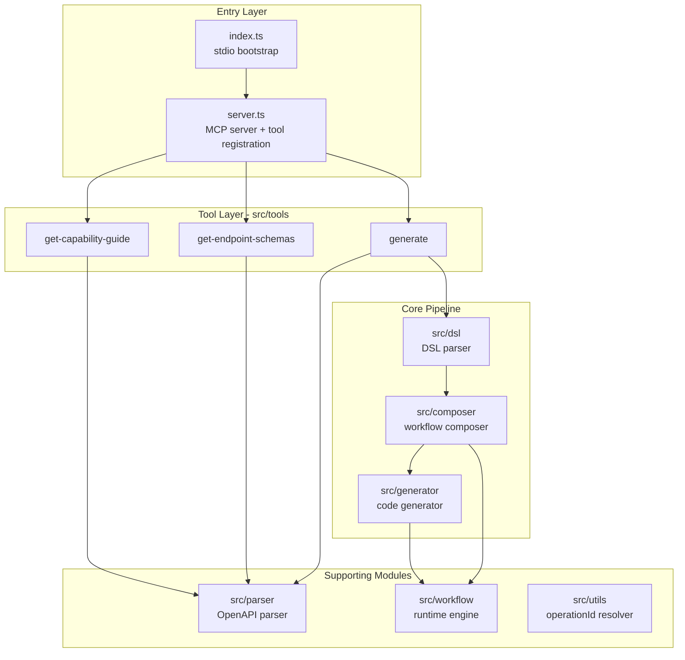

---

## 5. Module Overviews

### 5.1 Entry Layer

- **`index.ts`** — Process bootstrap. Creates the MCP server and connects it over a stdio transport.
- **`server.ts`** — Builds the `McpServer`, registers the three tools with their descriptions and schemas. This is the composition root.

### 5.2 Tool Layer — `src/tools`

The request handlers for each MCP tool. They orchestrate the core modules and shape the responses returned to the AI.

- **`get-capability-guide.ts`** — Handler for discovery. Asks the parser for all endpoints and formats them into a guide.
- **`get-endpoint-schemas.ts`** — Handler that returns exact request/response schemas for the operationIds the AI selected.
- **`generate.ts`** — The orchestrator for project generation. Drives parse -> compose -> generate.

### 5.3 DSL Module — `src/dsl`

Turns the author's DSL text into a structured, in-memory representation. This is the "front-end" of the compiler analogy.

- **`scanner.ts`** — Lexical pass over raw DSL text (line handling, comments, heredoc blocks).
- **`parser.ts`** — A recursive descent parser that builds projects, workflows, params, and steps.
- **`types.ts`** — DSL-level types (`DslWorkflow`, `DslStep`, `ParseDslResult`).
- **`index.ts`** — Public surface (`parseDsl`, types).

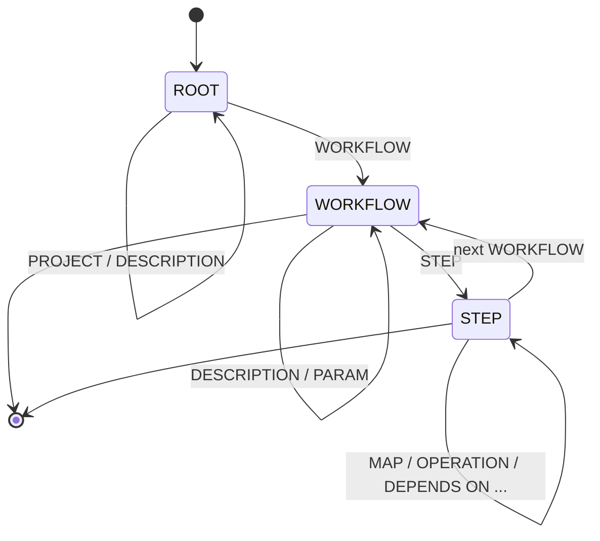

### 5.4 Composer Module — `src/composer`

The "middle-end" — semantic analysis, normalization, validation, and ordering. It takes raw parsed steps and produces a fully validated, dependency-ordered `WorkflowDefinition`.

| File               | Responsibility                                                              |
| ------------------ | --------------------------------------------------------------------------- |
| `composer.ts`      | Orchestrates the full validation/normalization pipeline                     |
| `dsl-mapping.ts`   | Adapts raw DSL workflow objects into the composer's input shape             |
| `validation.ts`    | Structural checks: unique ids, required fields, reference integrity, cycles |
| `normalization.ts` | Auto-fixes common authoring mistakes (template syntax, escaping)            |
| `inference.ts`     | Fills in omitted information (conditional targets, implicit dependencies)   |
| `warnings.ts`      | Emits non-fatal quality warnings (unused steps, orphans, deep chains)       |
| `types.ts`         | Composer-level input/output and warning types                               |

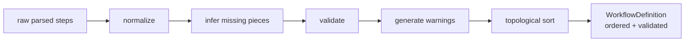

### 5.5 Generator Module — `src/generator`

The "back-end" — turns a validated `WorkflowDefinition` plus endpoint info into a complete set of project files.

| File               | Responsibility                                                      |
| ------------------ | ------------------------------------------------------------------- |
| `pipeline.ts`      | Full pipeline: DSL -> parsed -> composed -> generated project       |
| `project.ts`       | Assembles the complete file set for a project                       |
| `codegen.ts`       | Generates per-workflow tool files, endpoint maps, server entry      |
| `scaffold.ts`      | Static/templated files: REST client, package.json, tsconfig, README |
| `engine-bundle.ts` | Copies the workflow engine into the output                          |
| `dsl-mapping.ts`   | Maps DSL structures to generator input                              |
| `types.ts`         | Generator-level types                                               |

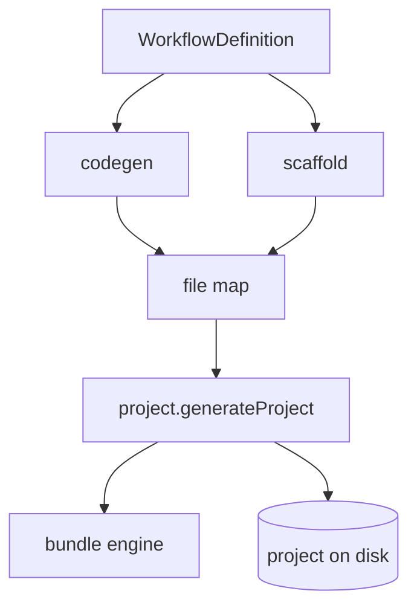

### 5.6 OpenAPI Parser Module — `src/parser`

Reads API knowledge from OpenAPI specs and exposes it to the tools.

| File                     | Responsibility                                                             |
| ------------------------ | -------------------------------------------------------------------------- |
| `spec-source.ts`         | Fetches and caches OpenAPI documents (in-memory / disk / remote)           |
| `spec-parser.ts`         | Implements `SpecParser`: lists endpoints and returns full endpoint details |
| `endpoint-extraction.ts` | Extracts compact and full endpoint records from a parsed spec              |
| `schema-mapper.ts`       | Converts OpenAPI schemas into JSON-Schema-style shapes                     |
| `types.ts`               | Domain, endpoint, and parser interface types                               |
| `index.ts`               | Public surface                                                             |

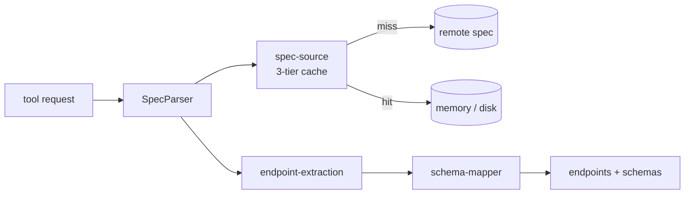

### 5.7 Workflow Module — `src/workflow`

The runtime engine. These files are **copied verbatim into every generated project** — they are both part of this repo and the runtime of the output.

| File                     | Responsibility                                                     |
| ------------------------ | ------------------------------------------------------------------ |
| `executor.ts`            | The execution loop: step scheduling, branching, error handling     |
| `api-call.ts`            | Executes `api_call` steps (payload, request, response parsing)     |
| `sampling.ts`            | Executes `sampling` (LLM) steps                                    |
| `templates.ts`           | Evaluates template expressions and resolves `{{...}}` placeholders |
| `expression-security.ts` | Guards expressions against dangerous patterns (AST allowlist)      |
| `types.ts`               | `WorkflowDefinition` / step types shared with codegen              |

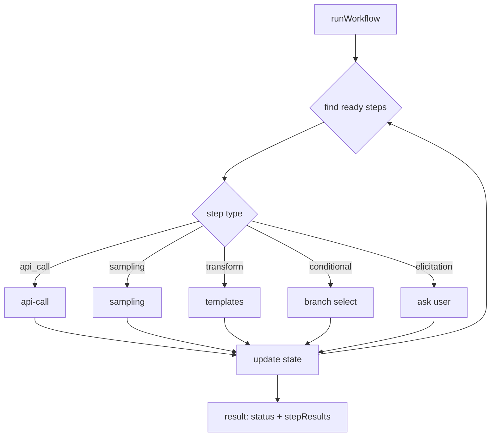

---

## 6. End-to-End Data Flow

The full journey from a DSL string to a project on disk:

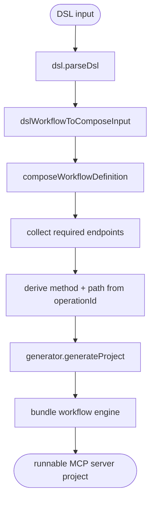

---

## 7. Pipeline-as-Compiler Analogy

The architecture mirrors a classic compiler:

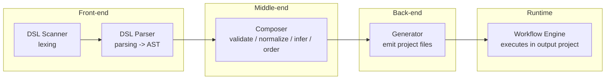

---

## 8. Generated Project — Output View

What the system produces:

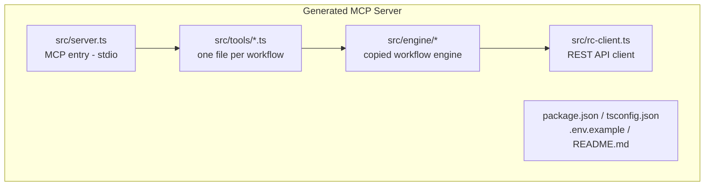

The generated server runs independently: an AI client calls a workflow tool, the engine executes its steps in topological order, and results flow back.

---

## 9. Step Types

The five workflow step types the engine understands:

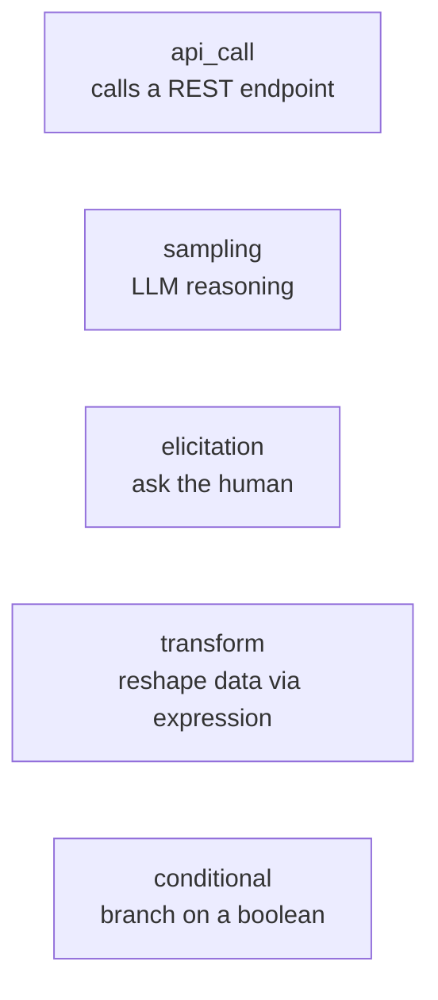

| Type          | Purpose                      | Required fields              | Output            |
| ------------- | ---------------------------- | ---------------------------- | ----------------- |
| `api_call`    | Call a REST endpoint         | `operationId`                | Parsed response   |
| `sampling`    | LLM reasoning/analysis       | `prompt`                     | Text or JSON      |
| `elicitation` | Ask the user, wait for input | `message`, `requestedSchema` | User response     |
| `transform`   | Reshape data                 | `expression`                 | Expression result |
| `conditional` | Branch execution             | `condition`, `thenStep`      | Boolean           |

---

## 10. Module Responsibility Summary

| Module          | Layer   | One-line responsibility                               |
| --------------- | ------- | ----------------------------------------------------- |
| `src/index.ts`  | Entry   | Boot the MCP server over stdio                        |
| `src/server.ts` | Entry   | Register the three MCP tools (composition root)       |
| `src/tools`     | Tool    | Request handlers for discovery, schemas, generation   |
| `src/dsl`       | Core    | Parse DSL text into structured workflows              |
| `src/composer`  | Core    | Validate, normalize, infer, and order workflows       |
| `src/generator` | Core    | Generate and write all project files                  |
| `src/parser`    | Support | Fetch/parse OpenAPI specs; expose endpoints + schemas |
| `src/workflow`  | Support | Runtime engine (copied into output)                   |
| `src/utils`     | Support | operationId reconciliation                            |
