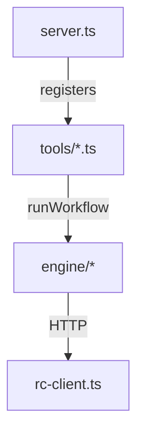
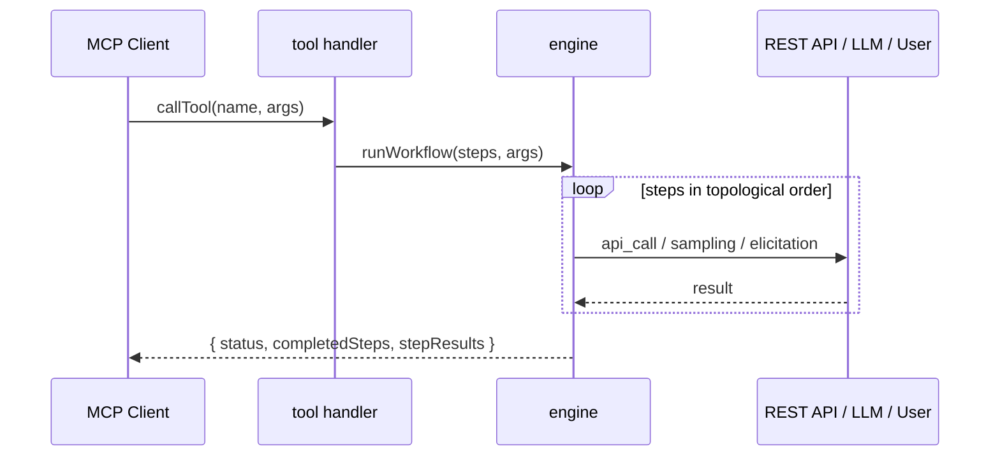

# Generated Project Anatomy

> What the generator produces, from the perspective of someone who received a generated project and wants to run, configure, understand, or extend it.

A generated project is a complete, self-contained, runnable MCP server. It does not depend on this generator at runtime — the workflow engine is copied in.

---

## 1. Directory Layout

```
<project-name>/
├── src/
│   ├── server.ts                 # Entry: MCP server + tool registration
│   ├── endpoints.ts              # operationId -> {method, path} registry
│   ├── rc-client.ts              # REST client (auth, headers)
│   ├── engine/                   # Runtime workflow engine (copied verbatim)
│   │   ├── workflow-engine.ts
│   │   ├── executor.ts
│   │   ├── api-call.ts
│   │   ├── sampling.ts
│   │   ├── templates.ts
│   │   └── expression-security.ts
│   ├── tools/
│   │   └── <workflow>.ts          # One file per workflow (step data + handler)
│   └── tests/
│       └── <workflow>.test.ts     # One test file per workflow
├── package.json
├── tsconfig.json
├── .gitignore
├── .env.example                   # copy to .env and fill in
└── README.md
```



---

## 2. What Each Piece Is

| File / dir | Purpose |
| --- | --- |
| `src/server.ts` | Builds an `McpServer`, imports each workflow tool, registers them with input schemas, and connects the transport |
| `src/endpoints.ts` | The `operationId -> { method, path }` registry |
| `src/rc-client.ts` | The REST client. Handles auth (tokens or auto-login), header injection |
| `src/engine/*` | The runtime that interprets step definitions: scheduling, template resolution, sandboxed evaluator, API execution, and sampling |
| `src/tools/<workflow>.ts` | Per workflow: the step definitions as data, metadata, and a handler that calls `runWorkflow` |
| `src/tests/*` | Generated tests per workflow |
| `.env.example` | Template for credentials. Copy to `.env` and fill in |
| `.gitignore` | Ignores `node_modules`, `dist`, and `.env` |
| `package.json` | Scripts (`start`, `build`, `test`) and dependencies |

---

## 3. Running It

```bash
cd <project-name>
npm install
cp .env.example .env      # fill in your credentials
npm start
```

`npm start` runs the server from source via `tsx`. The server speaks **stdio** by default — it's meant to be launched by an MCP client.

| Script | Does |
| --- | --- |
| `npm start` | Run with tsx (loads .env) |
| `npm run build` | Compile TypeScript to dist/ |
| `npm test` | Run the generated tests |

---

## 4. Configuration (`.env`)

```env
ROCKETCHAT_URL=http://localhost:3000

# Mode 1 - username/password (auto-login at startup)
ROCKETCHAT_USER=your-username
ROCKETCHAT_PASSWORD=your-password

# Mode 2 - pre-existing tokens
# ROCKETCHAT_AUTH_TOKEN=...
# ROCKETCHAT_USER_ID=...
```

If a workflow uses `sampling`, AI provider settings are also included:

```env
# GEMINI_API_KEY=...
```

---

## 5. Connecting to an MCP Client

The generated README includes ready-to-paste configs:

```jsonc
{
  "mcpServers": {
    "<project-name>": {
      "command": "node",
      "args": ["--env-file-if-exists=.env", "--import", "tsx", "src/server.ts"],
      "cwd": "/absolute/path/to/<project-name>"
    }
  }
}
```

---

## 6. How a Tool Runs

When the client invokes a workflow tool with arguments:



---

## 7. Extending a Generated Project

Because steps are **data**, light changes don't require touching the engine:

- **Tweak a workflow** — edit the step definitions in `src/tools/<workflow>.ts`
- **Add a workflow** — add a new tool file following the existing pattern, register it in `src/server.ts`
- **Change auth / base URL** — `.env` only; no code change

The engine files under `src/engine/` are copied verbatim from the generator. Avoid editing them by hand — changes should be made in the generator and re-generated.
