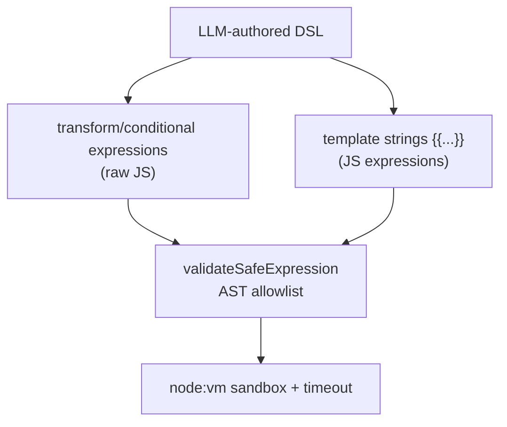

# Security Model

> The threat model for the generator and the servers it produces. The central risk is that LLM-authored expressions run as JavaScript, so the bulk of this document is about how transform/conditional/template expressions are constrained.

---

## 1. What Runs Untrusted Code

Three kinds of LLM-authored strings are evaluated as JavaScript:
- **`transform` expressions** — full JS bodies that return a value.
- **`conditional` conditions** — JS booleans.
- **`{{...}}` template expressions** — JS evaluated per placeholder.

Everything else (operationIds, MAP literals, prompts without templates) is inert data.

---

## 2. Defense in Depth

| Layer | Where | What it stops |
| --- | --- | --- |
| 1. Parse-time | `dsl/parser.ts` | Structurally invalid steps; MAP heredocs; malformed input |
| 2. Compose-time AST | `composer/validation.ts` | Unsafe transform/conditional before code is generated |
| 3. Runtime AST + sandbox | `workflow/expression-security.ts` + `workflow/templates.ts` | Re-checked on every evaluation, run in isolated VM with timeout |

The same `validateSafeExpression` runs at both compose time and runtime.

---

## 3. The AST Allowlist

`validateSafeExpression` parses the expression with **acorn** and walks the AST. The model is **deny-by-default**: a node type, identifier, property, or call is rejected unless explicitly allowed.

### 3.1 Allowed
- **Node types**: literals, arrays/objects, member access, conditionals/logical/binary/unary, arrow functions, blocks, if/return, template literals, let/const declarations, spreads.
- **Globals**: `undefined/null/true/false/NaN/Infinity`, safe call sets.
- **Identifier calls**: `Boolean`, `Number`, `String`, `parseInt`, `parseFloat`, `isNaN`, `isFinite`, `encodeURIComponent`, `decodeURIComponent`.
- **Static calls**: `Array.isArray/from`, `Date.now/parse`, `JSON.parse/stringify`, `Math.*`, `Number.*`, `Object.entries/fromEntries/keys/values`.
- **Instance methods**: common array/string methods (`map`, `filter`, `reduce`, `slice`, `join`, `includes`, `replace`, `split`, `sort`, `toLowerCase`, etc.).

### 3.2 Blocked
- **Properties**: `__proto__`, `constructor`, `prototype` — prototype-pollution vectors.
- **`var`** declarations (only `let`/`const`).
- **Mutation of `params`/`steps`** — only locally declared variables can be assigned.
- **Any unlisted call** — blocks `require`, `import`, `eval`, `Function`, `fetch`, `process.*`, timers, etc.

---

## 4. The Sandbox

Validated expressions run in `node:vm` with a constrained context and a hard timeout.

Properties:
- **No Node built-ins** beyond the explicit safe globals — no `require`, `process`, `Buffer`, `fs`, network, timers.
- **Fresh context per evaluation** (`runInNewContext`) — no shared mutable state.
- **100ms timeout** — caps runaway loops.
- **`"use strict"`** wrapping.
- **Template failures are swallowed** — a `{{...}}` that throws resolves to `""` rather than crashing the workflow.

---

## 5. Threat Checklist

| Threat | Mitigation | Residual risk |
| --- | --- | --- |
| Arbitrary code via transform/conditional | AST allowlist (compose + runtime) + vm + timeout | POC-grade; no formal audit |
| Prototype pollution / constructor escape | Blocked properties | — |
| Module/host access (require, process, fetch) | deny-by-default calls + no built-ins in sandbox | — |
| Infinite loop / DoS in expression | 100ms vm timeout | many steps can still be slow |
| Reading secrets via process.env | not in sandbox | secrets still live in server env |
| Oversized / abusive API payloads | field validation | API-side limits still apply |

---

## 6. Operational Recommendations

- Run generated servers with a **least-privilege** Rocket.Chat account.
- Keep credentials in the server's `.env`, never in the DSL or generated source.
- Review generated transform/conditional code before deploying to production.
- Treat content fetched by sampling and external specs as untrusted input.
